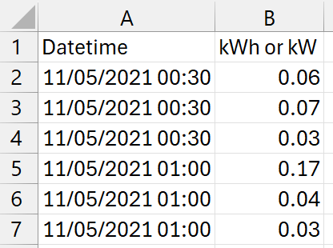
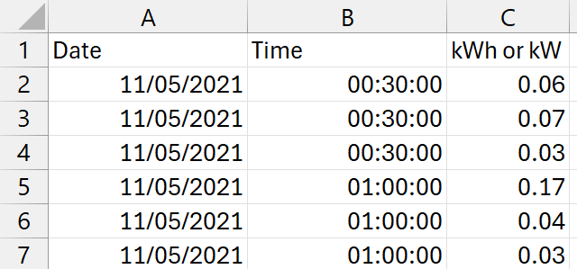
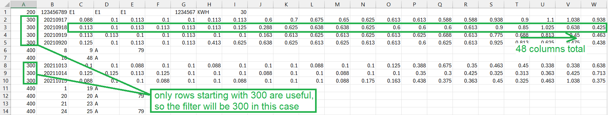
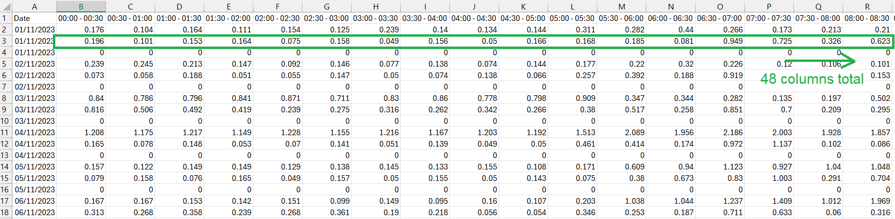

# Consumption CSV file fixer for SolarPlus (solarplus-csv-fixer)

## Description
This repository contains three Python scripts that you can use to convert your CSV consumption files into the specific data formats accepted by SolarPlus.  
I developed these scripts as an exercise to improve my Python skills with the help of ChatGPT. So, if you have any suggestions or would like to contribute, feel free to do so. 

## How to use
You can simply clone the repository or copy the code from the Python files. The script relies on basic functions supported by Pandas.

1. Clone the repository
2. Set up a virtual environment
3. Install dependencies using ```pip install -r requirements.txt```

The input files **must** be in CSV format.

The steps to use are similar for all three scripts. You just need to select the appropriate script for your use case:
* **2 column** - when the CSV file contains data that can be reduced to just two columns: [Datetime] and [kWh or kW]
* **3 column** - when the CSV file contains data that can be reduced to three columns: [Date], [Time], and [kWh or kW]
* **row to a day** - when the CSV file contains data where kWh or kW readings are recorded across columns (for example, each date has 48 columns of records, i.e., 30-minute intervals).

**The steps are as follows:**
* Locate and edit the ```csv_path```
* Run the script  
  * for the ```row-to-a-day.py``` script, you'll be prompted for some inputs
    * type ```Y``` and press ```Enter``` on your keyboard if you want to use a filter; otherwise, type ```N``` and press  ```Enter```
      * Use the filter when the first column of the CSV contains an identifier that can help you identify which rows have consumption data (check the section [here]((#when-the-first-column-contains-ids-requires-filter)))
      
## Data handling logic

### 2-column method


* The first 2 columns of the CSV file are read into a Pandas DataFrame
* The first column is converted to a datetime value
* Duplicate datetime stamps are grouped into one value by summing their kWh or kW values
* The time interval between consecutive rows is checked
* The most common time interval is kept (for example, if there are 200 records with 30-minute time intervals and 100 records with 5-minute time intervals, the 5-minute records are removed — this is a common case and helps in handling inconsistent time intervals)
* Any missing kWh/kW values are filled with the same value as the last valid predecessor value

### 3-column method
 

* The first three columns of the CSV file are read into a Pandas DataFrame
* The first two columns are combined into one, so the format becomes the same as the 2-column method for processing
* The rest of the data handling logic is the same as the 2-column method

### Row to a day method
#### When the first column contains IDs (requires filter)
> **Note: If the first column contains the same ID for all rows, you can enter that ID as the filter value.**


#### When the first column contains dates (no filter needed)
  

* The full CSV file is read into a Pandas DataFrame
* Empty rows and columns are deleted
* The user is prompted to confirm whether a filter is to be used
  * If the user answers with ```Y```, a filter value must be provided
    * The DataFrame uses the filter value to keep only the rows where the first column value matches the filter value. The rest of the rows are deleted.
    * After filtering, the first column is deleted, and the first column is now expected to be the date column.
* The first column is converted to a datetime value
* A column count is made for each row (to determine the time interval — 48 columns would indicate a 30-minute time interval)
* Rows with the same column count as the most common time interval are kept, while the rest are deleted
* To handle cases where extra columns exist after the useful data in the CSV file (such as identifier column values at the end of each row), the usable number of columns is calculated based on the time interval identified, and any columns after the usable ones are deleted
* Any missing kWh/kW values are filled with the same value as the last valid predecessor column's value
* Any missing days are filled with the same values as the last valid day's values
